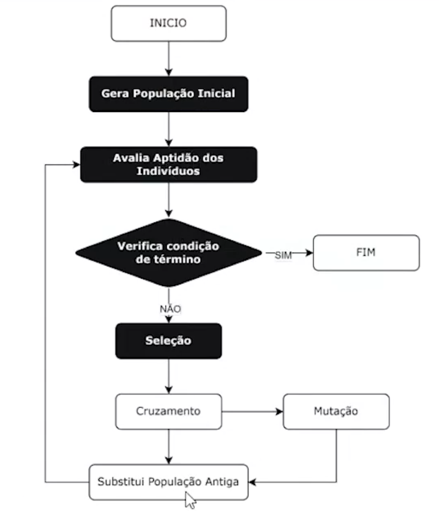

# Algoritmo Genético para o Problema do Caixeiro Viajante (TSP) com Pygame

Este documento detalha a implementação de um Algoritmo Genético para resolver o Problema do Caixeiro Viajante (TSP - Traveling Salesman Problem) com visualização usando Pygame.

## Explicação do Código

O código apresentado implementa um Algoritmo Genético para resolver o Problema do Caixeiro Viajante (TSP - Traveling Salesman Problem) com visualização usando Pygame. O código está dividido em duas classes principais:

*   `PyGameGA`: Uma classe base que gerencia a inicialização do Pygame, o loop principal, o desenho das cidades, caminhos e gráficos na tela.
*   `GeneticAlgorithm`: Uma classe que herda de `PyGameGA` e implementa a lógica do Algoritmo Genético, incluindo a geração da população inicial, cálculo da aptidão (fitness), seleção, cruzamento (crossover) e mutação.

## Definição do Problema

O Problema do Caixeiro Viajante (TSP) é um problema de otimização que consiste em encontrar a rota mais curta que visite um conjunto de cidades exatamente uma vez e retorne ao ponto de partida. O objetivo é minimizar a distância total percorrida, dadas as distâncias entre cada par de cidades.

A localização de cada cidade é dada pela sua posição de latitude (eixo y) e longitude (eixo x). Logo, podemos representar cada cidade como uma tupla com valores x e y, por exemplo:

*   Cidade 1: (733, 251)
*   Cidade 2: (706, 87)
*   Cidade 3: (546, 97)
*   Cidade 4: (562, 49)
*   Cidade 5: (576, 253)

## Fluxograma do Algoritmo Genético

O Algoritmo Genético segue o seguinte fluxo:

1.  **Início:** O ponto de partida do algoritmo.
2.  **Gera População Inicial:** Cria um conjunto de soluções aleatórias (rotas) para o problema.
3.  **Avalia Aptidão dos Indivíduos:** Calcula a qualidade de cada solução na população (quão curta é a rota).
4.  **Verifica Condição de Término:** Decide se o algoritmo deve parar (atingiu um número máximo de gerações, encontrou uma solução boa o suficiente, etc.).
    *   **SIM:** Fim do algoritmo.
    *   **NÃO:** Continua para a próxima etapa.
5.  **Seleção:** Escolhe os indivíduos (rotas) mais aptos para serem pais da próxima geração.
6.  **Cruzamento:** Combina as características de dois pais para criar um ou mais filhos.
7.  **Mutação:** Introduz pequenas alterações aleatórias nos filhos para manter a diversidade genética.
8.  **Substitui População Antiga:** A nova geração de filhos substitui a população antiga, e o processo se repete.

## Ilustração do Fluxograma

## Cálculo de Fitness

Como vimos, o cálculo de fitness é feito usando a função `calculate_distance`, que retorna a distância euclidiana dado dois pontos. Entretanto, esse método é ineficiente computacionalmente pois executa repetidamente os mesmos cálculos de distância entre as cidades.

Uma abordagem mais eficiente é usando a matriz adjacente, ou matriz de distâncias. No contexto do "Problema do Caixeiro Viajante" (PCV), a matriz adjacente é uma matriz quadrada que representa as distâncias entre todas as cidades no problema. Se houver n cidades, a matriz terá dimensões n x n, e a entrada D[i][j] na linha i-ésima e coluna j-ésima representará a distância entre a cidade i e a cidade j. A matriz é chamada de "adjacente" porque mostra a adjacência ou conectividade entre as cidades.

A distância total de uma rota é encontrada somando as distâncias entre cada par consecutivo de cidades na rota, conforme representado pelos índices na matriz adjacente. Se a rota for representada por uma lista de cidades visitadas (R = \[c1, c2, ..., cn]), onde (ci) é o índice da cidade na matriz, então a distância total ao longo dessa rota é dada por:

D(R) = D[c1][c2] + D[c2][c3] + ... + D[cn][c1]

onde D(ci][cj] é a distância entre as cidades ci e cj na matriz adjacente.

A vantagem de usar a matriz adjacente é que ela permite calcular a distância entre duas cidades em tempo constante O(1), pois é apenas uma operação de acesso à matriz. Assim, o cálculo da distância total de uma rota pode ser feito em tempo linear O(n), onde n é o número de cidades na rota. Isso representa uma melhoria significativa em relação ao método anterior, especialmente para um grande número de cidades.
